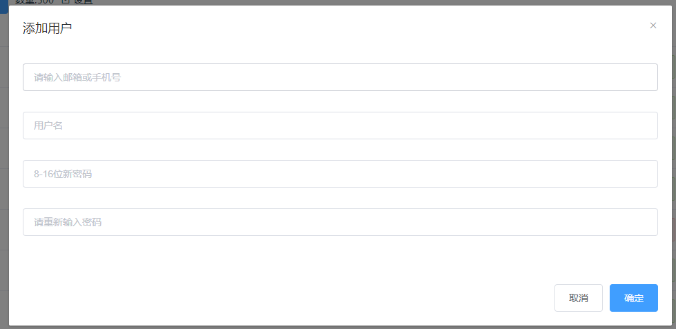

# element-form-dialog 组件说明
组件用于表单类弹窗，可自由插入任意表单，预设了表单提交验证，表单提交 loading，防止多次提交。



## 属性
### title
必填，设置弹窗顶部的标题

类型：String

### width
可选,设置弹窗宽度，详情见[这里](https://element.eleme.io/#/zh-CN/component/dialog#attributes)

类型：String

### cancelText
可选，设置弹窗取消按钮的文本

类型：String

默认：取消

### successText
可选，设置弹窗确定按钮的文本

类型：String

默认：确定

## 事件
### closed
窗口关闭事件

### submit
窗口点击确认按钮关闭窗口时触发，同时也会触发 closed 事件

### cencel
窗口点击取消按钮关闭窗口时触发，同时也会触发 closed 事件

## 接口方法
### closeModel: () => void
窗口关闭

### openModel: ({submit, cancel, data}) => void
窗口打开

submit: () => void  确定按钮回调，不与 submit 事件冲突，可同时被触发
cancel: () => void  取消按钮回调，不与 cancel 事件冲突，可同时被触发
data: any  希望传入表单的数据

## 表单
中间核心组件，通过子组件插入，可以使用 element-ui 的 [Form](https://element.eleme.io/#/zh-CN/component/form) 来组织，也可以用其他的组件，但组件必须实现 2 个方法：

- validate: () => Promise
  
表单验证，必须返回一个 Promise 实例，验证通过走 resolve，失败走 reject。

- request: () => Promise

表单提交，必须返回一个 Promise 实例。

## <font color=red>注意</font>
插入的表单组件设置 ref，只能通过 model 实例的 $refs 获取，具体看下面例子：

```javascript
/**
 * 此时要拿到 export-all-form 的 ref，请使用 this.$refs.exportAll.$refs.form
 */
<el-form-dialog
  ref="exportAll"
  :title="$t('message.Please select the source language')"
>
  <export-all-form ref="form" />
</el-form-dialog>
```